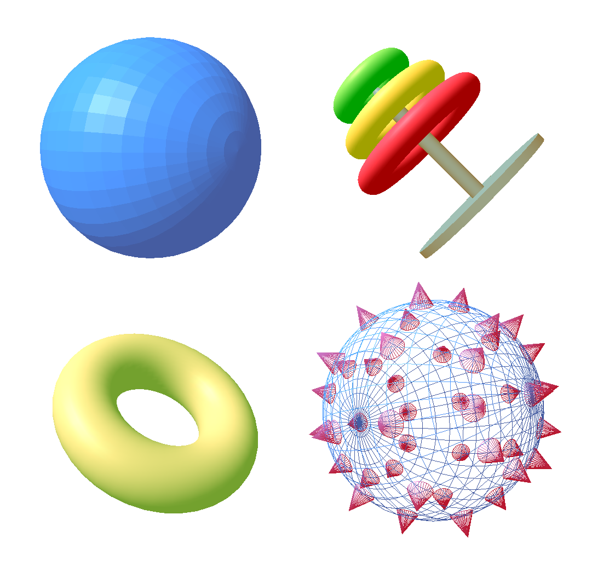
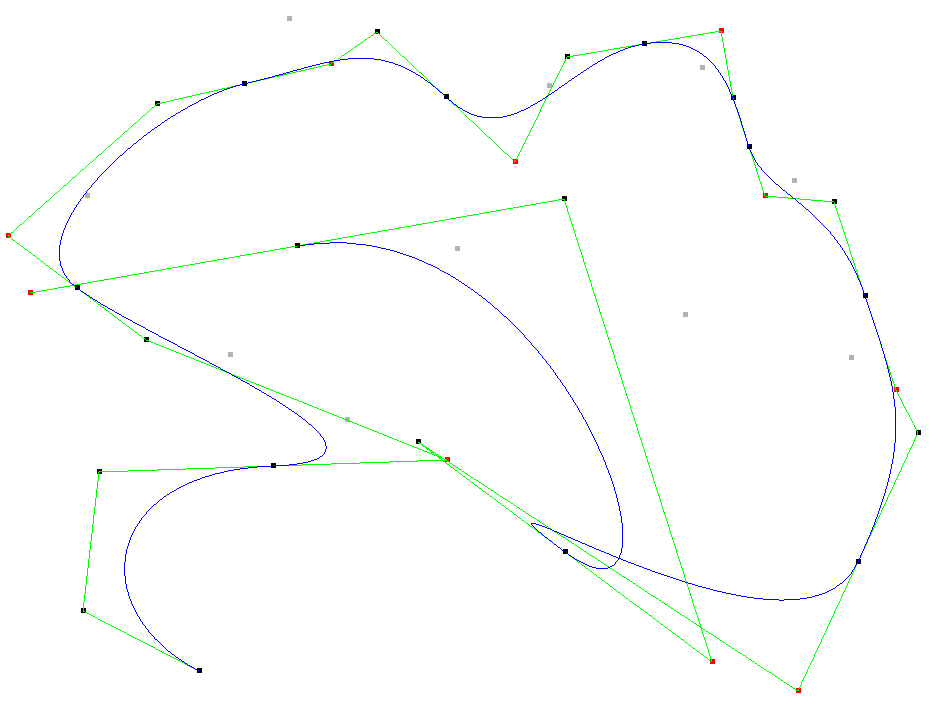
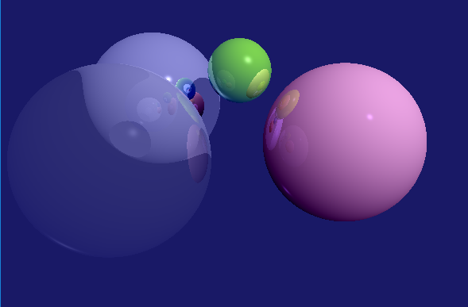

# Computer graphics labs
This is my coursework, completed as a part of the CS3241 Computre graphics course at the National University of SIngapore taught by Dr Ho Lung Cheng.

### Lab 1 - Simple 2D drawings with OpenGL

### Lab 2 - More 2D Drawings
### Lab 3 - Drawing in 3D, Ilumination

### Lab 4 - Bezier curves

### Lab 5 - Ray Tracing`

